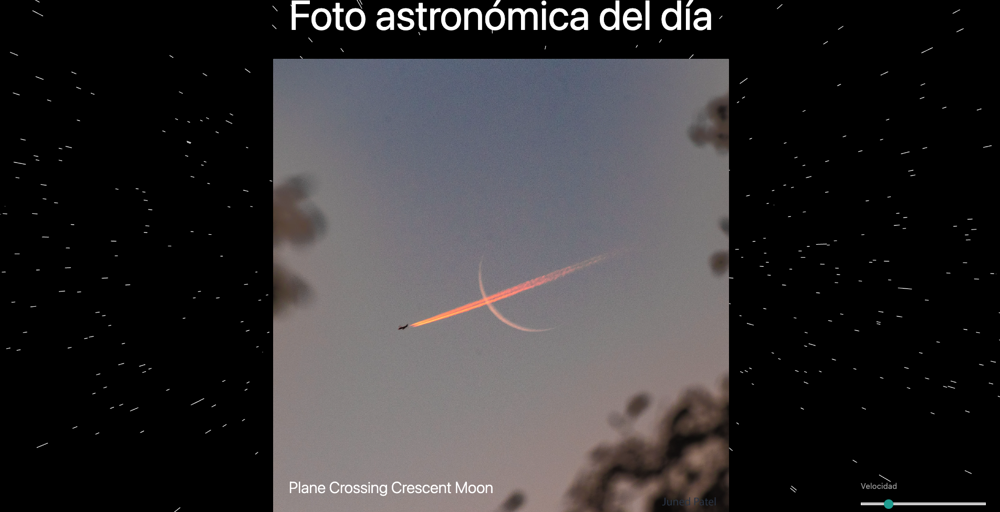
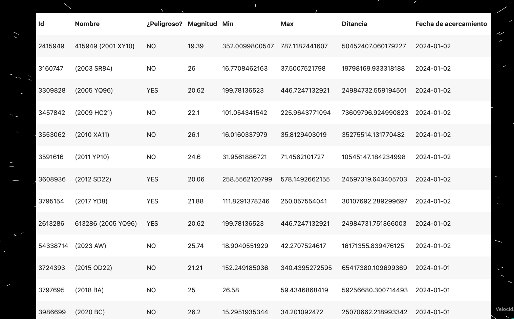

# NASA Asteroid Explorer

Este proyecto es una aplicación web que utiliza la API de la NASA para recoger datos sobre asteroides. La interfaz de usuario está diseñada con Materialize CSS y muestra información detallada sobre los asteroides, incluyendo imágenes, descripciones y características. La aplicación permite filtrar la información, ver detalles individuales y ofrece una experiencia de usuario amigable.

## Características

- **Consumo de API:** La aplicación consume la [API de la NASA](https://api.nasa.gov/) para obtener datos sobre asteroides.
- **Interfaz Atractiva:** La interfaz de usuario utiliza Materialize CSS para una apariencia moderna y receptiva.
- **Presentación de Datos:** Los datos se presentan de manera organizada utilizando tarjetas y tablas.
- **Paginación:** La sección de asteroides está implementada con paginación para una mejor experiencia de usuario.
- **Detalles de un Solo Elemento:** Se puede ver el detalle completo de un asteroide haciendo clic en él.
- **Filtrado de Información:** Los datos pueden filtrarse mediante una barra de búsqueda o categorías.

## Capturas de Pantalla


*Página principal con tarjetas de asteroides*


*Detalles de un asteroide*

## Modo de Uso

1. Clona este repositorio: `git clone https://github.com/tuusuario/nasa-asteroid-explorer.git`
2. Abre el archivo `index.html` en tu navegador web.

## Estructura del Proyecto

- **index.html:** Página principal de la aplicación.
- **style.css:** Hoja de estilos para el diseño de la interfaz.
- **script.js:** Archivo JavaScript para la lógica de la aplicación.
- **api.js:** Configuración y funciones para la llamada a la API de la NASA.

## Configuración de la API

Antes de ejecutar la aplicación, asegúrate de obtener tu clave de API gratuita de la [NASA API](https://api.nasa.gov/). Reemplaza la variable `apiKey` en el archivo `api.js` con tu clave.

```javascript
const apiKey = 'TU_CLAVE_DE_API';
```

## Despliegue

Este proyecto puede ser desplegado fácilmente en plataformas como GitHub Pages, Netlify o Vercel. Simplemente sigue las instrucciones de despliegue de la plataforma de tu elección.

## Enlaces

- [Figma Design](https://www.figma.com/file/XXXXXXXXX/nasa-asteroid-explorer)
- [Repositorio en GitHub]([https://github.com/tuusuario/nasa-asteroid-explorer](https://github.com/Moriarty369/nasa-api-js))
- [Enlace de Despliegue](https://tudominio.com/nasa-asteroid-explorer) (si aplica)

¡Explora el universo de asteroides con esta aplicación! 🚀✨
